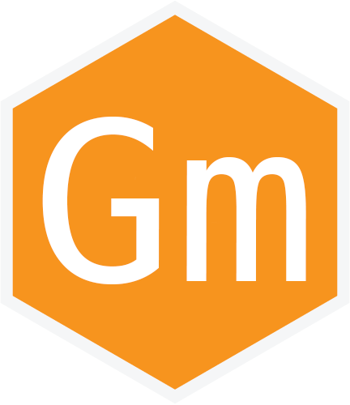

# Glowstone
* Florida Institure of Technology
* CSE2410 Intro to Software Engineering
* Spring 2018

## Group Members
* Shane McConkey
* Jordan Murray
* Justin Tomlin
* Zhen Xu

## Instructors
* Dr. Keith Gallagher
* Isabella DeMeo

## K/D/A (Kill/Death/Assist)
| Name | Kills | Deaths | Assists | First Blood | Double Kill | Triple Kill | Quadra Kill | PENTA KILL |
| --- | --- | --- | --- | --- | --- | --- | --- | --- |
| Jordan Murray | 0 | 0 | 0 | F | 0 | 0 | 0 | 0 |
| Justin Tomlin | 0 | 0 | 0 | F | 0 | 0 | 0 | 0 |
| Shane McConkey | 0 | 0 | 0 | F | 0 | 0 | 0 | 0 |
| Zhen Xu | 5 | 0 | 1 | T | 2 | 0 | 0 | 0 |
### Terms
1. Kill: Submit a pull request and got approved.
2. Death: Submit a pull request and got rejected.
3. Assist: Submit an issue or comtribute to other pull requests.
4. First Blood: Got the first pull request approved in class.
5. Double Kill, Triple Kill, Quadra Kill, PENTA KILL: Different amounts of kills achieved in a single day.
